# Revit2Reality_Project[SamLi]
A project to transfer the wireframe style building into realistic style

## All the process is based on Cycle-GAN

### 1) 5.14
- Abstract
  - Collected the wireframe style buildings' data (Screenshot from the .rvt file) and architecture images in real life (part from https://www.kaggle.com/datasets/tompaulat/modern-architecture-100k-small-images) as the training dataset [About 1400 images for each datasets, by using the horizontally filpped data augmentation method]. Using the sample code provided on Cycle-GAN Github, I got the final model after 200 times epoch (About 10 hours training on Nvidia-RTX3080).

- Training Process

  - I would like to show just one side of this cycle-Gan model in this part (changing wireframe style buildings into reality ones). You can simply reckon that the wireframe building model (real_A.png) would firstly generated into fake_B.png by Generator1, and then by using the Generator2, the fake_B.png would changed into rec_A.png. By comparing the loss between real_A.png and rec_A.png, we would consider if the generator1 can get a 'similar' output with the input image. Here is the sample generated process during the training. [model files are too big to be able upload orz, so I just uploaded the training process .txt files]
 
  - epoch 1:

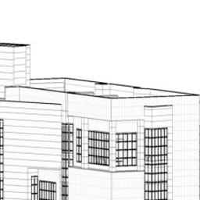    ----> 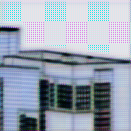    ----> 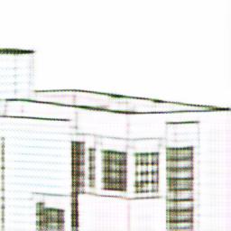

  - epoch 51:

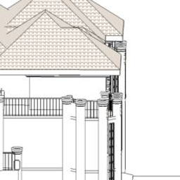    ----> 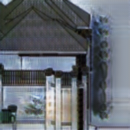    ----> 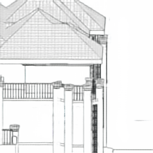

  - epoch 101:

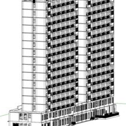    ----> 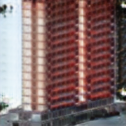    ----> 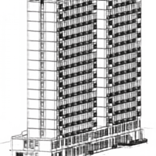

  - epoch 150:

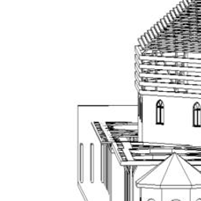    ----> 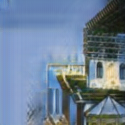    ----> 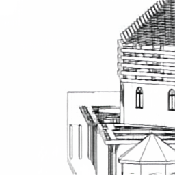

  - epoch 200:

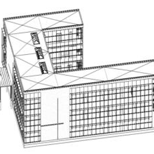    ----> 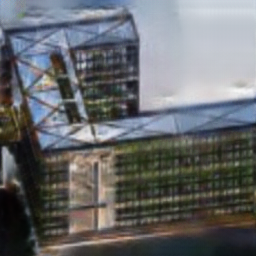    ----> 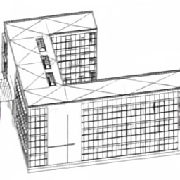

- Things to improve
  - The generated images are still have a distance to the real life images, part because:
    - Quality of training dataset is not good enough (the outside appearance that I selected from modern-architecture-100k-small-images are not good)
    - Quantity of the data are not enough.
    - Add training epoch times?

- Problems to solve
  - Seems that https://www.kaggle.com/datasets/wwymak/architecture-dataset is a greater dataset to select training data from.
  - Maybe we need to filter the dark mode pictures firstly.
